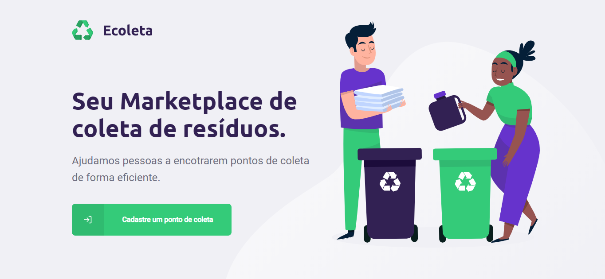
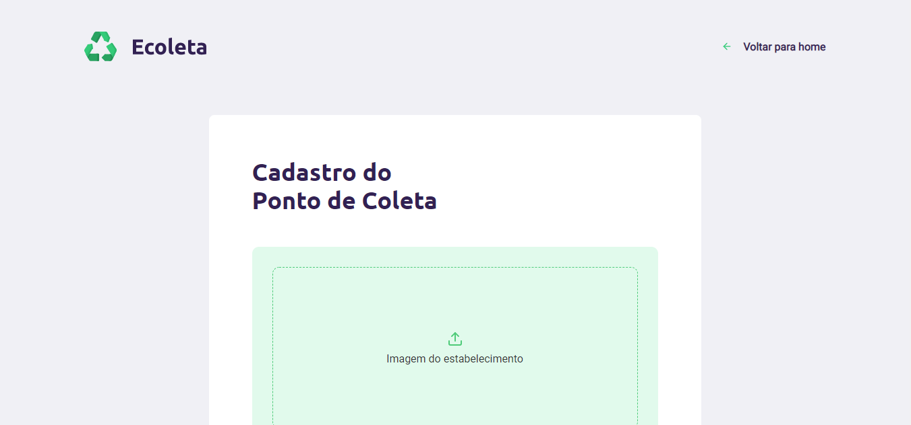
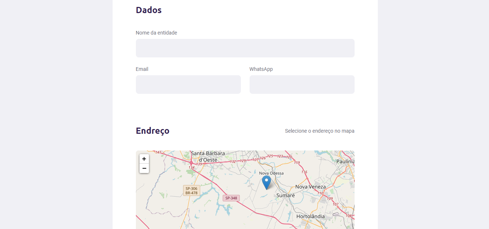
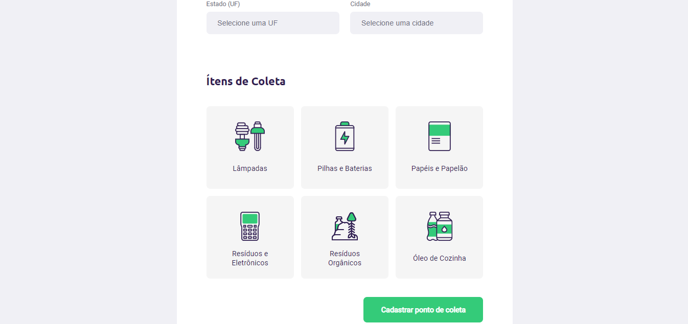

## Overview 
<div>
 
 
 
 
</div>

## About 
This project was developed to help people find places for waste collection points.<br/>
In the __web application__, the Establishment can register your collect point.<br/>
In the __[mobile application](https://github.com/pferreirafabricio/react-native-ecoleta)__, the user can view all points, filtering by UF, city and items, as well as view a specific point and send an email and or message to the establishment.
> Check here the project API: __[Ecoleta API](https://github.com/pferreirafabricio/node-ecoletaApi)__
## Technologies 
This project was built with:
- [React](https://reactjs.org/)
- [React Navigation](https://reactnavigation.org/)

## Installing and Running  
 1. Clone this repository ```git clone https://github.com/pferreirafabricio/react-ecoleta/```;
 2. Enter in the project's folder: ```cd react-ecoleta```
 3. Install all project's dependencies: ```$ npm install```
 4. Run the project: ```$ npm start```😃
 
## Contribute
 1. Fork this repository;
 2. Create a branch with your feature: ```git checkout -b my-feature```
 3. Commit your changes: ```git commit -m 'feat: My new feature'```
 4. Push your branch: ```git push origin my-feature```
 
## License
This project is under the MIT license. Take a look at the [LICENSE](LICENSE.md) file for more details.

